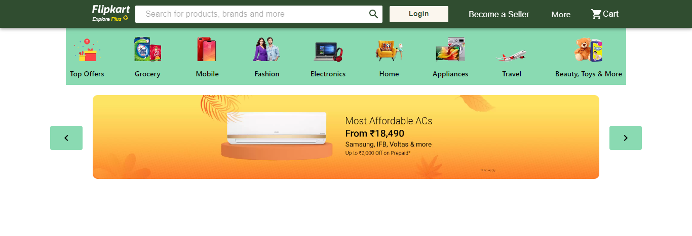

<div align="left">

  <h1 align="left">Avataar</h1>

  <p align="left">
    <br />
    <a href="#"><strong>Its an assignment given by Avataar.ai in which I made a Dynamic menu and Carousel without using any library.</strong></a>
    <br />
  </p>
</div>

<p align="center">
  
</p>

<!-- GETTING STARTED -->
## Getting Started

This is an example of how you may give instructions on setting up your project locally.
To get a local copy up and running follow these simple example steps.

### Prerequisites

Install Node on your system for this project
* Node

### Installation

1. Clone the repo
   ```sh
   git clone https://github.com/HRISHABHTRIPATHI/avataar.git
   ```
2. Install node packages
    * Windows/Mac/Linux
        ```sh
        npm install
        ```


### Run
1. Run your React project
    * Windows/Mac/Linux
        ```sh
        npm start
        ```

### Deployment
1. Deploy your React project
    * Windows/Mac/Linux
        ```sh
        npm install gh-pages --save-dev
        npm run deploy
        ```


<!-- CONTACT -->
## Contact

Hrishabh Tripathi -  hrishabhtripathi54@gmail.com

Linkedin : [hrishabhtripathi](https://www.linkedin.com/in/hrishabhtripathi/)

Project Link: [https://github.com/HRISHABHTRIPATHI/avataar](https://github.com/HRISHABHTRIPATHI/avataar)


